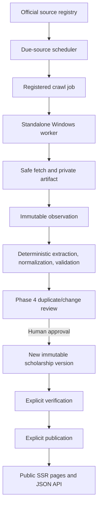

# Scholarship Tracker AI

Scholarship Tracker AI is a scholarship lifecycle and discovery platform built with Laravel 12, PHP 8.3+, MySQL, and Vue 3. It manages scholarship programs and application cycles, preserves version and evidence history, and publishes only explicitly verified scholarship information.

The project name includes “AI,” but the current extraction pipeline is deterministic. No AI provider or API key is required.

## What it does

- Maintains reusable country, region, university, subject, and degree catalogs.
- Stores scholarship programs separately from their application cycles, with cycle-scoped funding and eligibility requirements.
- Captures immutable scholarship versions and append-only verification and publication decisions.
- Provides server-rendered public scholarship and catalog pages plus a versioned JSON API. Public discovery follows one server-side visibility rule: a scholarship must be both verified and published.
- Supports authenticated administration with Laravel Sanctum sessions and role/permission checks.
- Collects source observations through an independent PHP CLI crawler worker. The worker uses registered URLs, safe-fetch rules, robots policy, bounded artifacts, and lease-fenced jobs; it does not connect to MySQL.
- Schedules due crawl jobs from the existing source registry and sends observations through deterministic HTML/JSON processing into the human review workflow.

Extraction creates reviewable candidate facts. It does not verify or publish scholarships. Human approval, verification, and publication remain separate steps.

## How the parts fit together



## Technology

- **Backend:** PHP 8.3+, Laravel 12, MySQL 8+
- **Frontend:** Vue 3, Vue Router, Pinia, Axios, Vite, Tailwind CSS
- **Crawler worker:** Standalone PHP 8.3+ CLI application in `crawler-worker/`
- **Tests:** PHPUnit / Laravel feature tests, plus a standalone worker test runner

## Get started

### Requirements

- PHP 8.3+ with the extensions listed in [Local setup](docs/setup/local.md)
- Composer 2
- Node.js and npm
- MySQL 8+ for local application development

### Install

From the project root, in PowerShell:

```powershell
composer install
Copy-Item .env.example .env
php artisan key:generate
```

Create a local database and configure `DB_DATABASE`, `DB_USERNAME`, and `DB_PASSWORD` in `.env`. Keep local, test, and production databases separate. Then install frontend packages, migrate the configured local database, and start the app:

```powershell
npm.cmd ci
php artisan migrate --seed
npm.cmd run dev
```

In a second terminal:

```powershell
php artisan serve --host=localhost --port=8000
```

Open <http://localhost:8000>. More configuration—including Sanctum, CORS, database, and authentication notes—is in [docs/setup/local.md](docs/setup/local.md).

## Public pages and API

Public pages are rendered by Laravel and remain useful without JavaScript:

- `/` — home and discovery entry
- `/scholarships` — published scholarship cycles
- `/scholarships/{slug}` — scholarship details
- `/universities/{slug}`
- `/countries/{slug}`
- `/subjects/{slug}`
- `/degrees/{slug}`

The public JSON API starts at `/api/v1/scholarships`. Catalog and authentication APIs are also versioned under `/api/v1`. Crawler worker endpoints use a separate scoped credential and are not user-session endpoints. See [API conventions](docs/api/conventions.md).

## Crawler and data-quality lifecycle

The source registry is the authority for URLs, crawl permissions, frequency, priority, path scope, robots policy, and per-source concurrency. Laravel schedules due jobs; the independent Windows worker claims jobs, validates destinations, fetches bounded content, and submits private artifacts and results. The worker never accesses the Laravel database.

Accepted HTML observations are processed with a deterministic parser; JSON observations retain the existing structured JSON parser. Candidate values carry evidence back to the source, observation, artifact, parser version, and processing run. Ambiguous or invalid values remain reviewable, and missing benefits remain unknown rather than becoming zero. PDFs are retained with an explicit unsupported-parser result; PDF extraction/OCR is not implemented.

The Phase 4 review workflow owns duplicate candidates, change proposals, review decisions, approved canonical changes, immutable version creation, and field provenance. Phase 2.2 owns verification and publication. Phase 3 public discovery reads only eligible verified, published snapshots.

Architecture and operation guides:

- [Phase 0 foundation](docs/architecture/phase-0-foundation.md) and [Phase 0.1 architecture patch](docs/architecture/phase-0.1-architecture-patch.md)
- [Scholarship core](docs/architecture/phase-2-scholarship-core.md), [verification and publication](docs/architecture/phase-2.2-verification-publication.md), and [public discovery](docs/architecture/phase-3-search-discovery.md)
- [Phase 4 review and provenance](docs/architecture/phase-4-data-quality-review.md)
- [Phase 5 crawler and worker](docs/architecture/phase-5-crawler.md), [safe fetch](docs/architecture/phase-5b2-safe-fetch.md), [observation handoff](docs/architecture/phase-5c-observation-handoff.md), and [due scheduling](docs/architecture/phase-5d-crawler-scheduling.md)
- [Phase 6 extraction, normalization, and validation](docs/architecture/phase-6-extraction-normalization-validation.md)
- [cPanel deployment notes](docs/deployment/cpanel.md)

## Scheduler operation

Laravel dispatches due sources hourly and reaps expired crawler leases every minute. A cPanel installation should invoke the Laravel scheduler each minute with `php artisan schedule:run`; the actual PHP binary and cron path depend on the hosting account. Inspect registered entries with:

```powershell
php artisan schedule:list
```

The Windows worker remains a separate process and must be online to claim scheduled jobs. See [Phase 5D verification and operations](docs/setup/phase-5d-verification.md).

## Tests and verification

The default PHPUnit configuration uses an in-memory SQLite database:

```powershell
php artisan test
npm.cmd run build
```

For MySQL integration tests, configure the process to use a dedicated database such as `scholarship_tracker_test`. Do not run test migrations against the primary development database. Example for PowerShell (adjust the port for your MySQL installation):

```powershell
$env:APP_ENV = 'testing'
$env:DB_CONNECTION = 'mysql'
$env:DB_DATABASE = 'scholarship_tracker_test'
$env:DB_HOST = '127.0.0.1'
$env:DB_PORT = '3306'
php artisan test --compact
```

Run the standalone worker suite from its directory:

```powershell
Set-Location crawler-worker
php tests/run.php
```

Phase 6 verification and fixture coverage are described in [docs/setup/phase-6-verification.md](docs/setup/phase-6-verification.md). The latest recorded verification for the current workspace was **81 Laravel tests / 646 assertions** and **39 worker tests / 171 assertions**, with one environment-specific Windows Credential Manager skip. Passing local tests do not establish production cPanel configuration or hosting limits; see [deployment notes](docs/deployment/cpanel.md).

## Project boundaries

The current implementation does not include AI extraction, PDF/OCR extraction, automatic review approval, automatic verification or publication, notifications, or student-to-scholarship matching. Those behaviors are intentionally outside the implemented phases.
